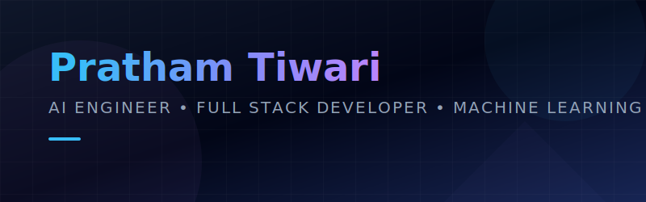

<!--
============================================================================
  README.md — Premium GitHub Profile
============================================================================
  HOW TO USE THIS FILE
  1. Create a repository named EXACTLY like your GitHub username
     (e.g. if your username is "octocat", repo name = "octocat").
  2. Drop this file in as README.md, along with assets/banner.svg
     and .github/workflows/snake.yml (see FOLDER STRUCTURE section
     near the bottom for the full layout).
  3. Find-and-replace every placeholder below:
       YOUR_GITHUB_USERNAME   -> your GitHub handle
       YOUR_LINKEDIN          -> your LinkedIn handle
       YOUR_TWITTER           -> your X / Twitter handle
       YOUR_EMAIL             -> your email address
       YOUR_PORTFOLIO         -> your portfolio URL
       YOUR_BLOG              -> your blog URL
       YOUR_LEETCODE / YOUR_CODEFORCES / YOUR_CODECHEF / YOUR_HACKERRANK
                              -> your handles on those platforms
  4. Each section below has an HTML comment explaining what it does
     and how to tweak it. Comments never render on GitHub.
============================================================================
-->

<div align="center">

<!-- ================= HERO BANNER =================
     Points at the animated SVG banner shipped in assets/banner.svg.
     Swap the file or its internal colors to re-theme the whole hero.
-->


<br/>

<!-- ================= ANIMATED TYPING INTRODUCTION =================
     Powered by the "readme-typing-svg" service. Edit the `lines`
     query param to change what gets typed. Add/remove `&lines=`
     entries for more phrases; separate words with + for spaces.
-->
<a href="#">
  
</a>

<br/>

<!-- ================= QUICK BADGES ROW =================
     A compact "status strip" recruiters see first. Edit freely.
-->

[]([https://linkedin.com/in/YOUR_LINKEDIN](https://www.linkedin.com/in/pratham-tiwari-28145a332/))

[](mailto:prathamjee97@gmail.com)


</div>

<br/>

<!-- ============================================================
     PROFESSIONAL SUMMARY
     A recruiter-facing elevator pitch. Keep this to 2-4 sentences.
============================================================ -->

## 🧭 Professional Summary

> B.Tech Information Technology undergraduate focused on **Full-Stack Engineering, Machine Learning, and Artificial Intelligence**. I build end-to-end AI-powered products — from OCR pipelines and recommendation engines to production-grade APIs and interfaces — with an emphasis on clean architecture, reproducibility, and real-world usefulness. Actively competing in hackathons and exploring research at the intersection of applied ML and systems design.

<br/>

<!-- ============================================================
     ABOUT ME
     Standard bio table. Add/remove rows as your profile evolves.
============================================================ -->

## 👋 About Me

<table>
<tr>
<td width="60%" valign="top">

- 🎓 **Currently studying:** B.Tech in Information Technology, Semester 4
- 🔭 **Currently building:** *Attendance Planner* — an AI-powered attendance optimization platform
- 🌱 **Currently learning:** Advanced system design, LLM tooling, and applied deep learning
- 🤝 **Open to collaborating on:** AI/ML projects, full-stack products, and hackathon teams
- 💬 **Ask me about:** Python, React, FastAPI, computer vision, and recommendation systems
- 📫 **Reach me at:** YOUR_EMAIL
- ⚡ **Fun fact:** I'd rather debug a model at 2 AM than leave a bug unresolved overnight

</td>
<td width="40%" valign="top" align="center">

```text
class Pratham:
    def __init__(self):
        self.role = "B.Tech IT Student"
        self.stack = ["Python", "React", "FastAPI"]
        self.focus = ["AI/ML", "Full-Stack", "Systems"]
        self.status = "Building & Learning"

    def say_hi(self):
        return "Let's build something great!"
```

</td>
</tr>
</table>

<br/>

<!-- ============================================================
     CURRENT FOCUS
============================================================ -->

## 🎯 Current Focus

<table>
<tr>
<th>Area</th>
<th>What I'm Doing</th>
</tr>
<tr>
<td><b>AI Product Building</b></td>
<td>Designing and shipping an AI-driven attendance recommendation system end-to-end</td>
</tr>
<tr>
<td><b>Computer Vision / OCR</b></td>
<td>Extracting structured data (timetables, calendars) from unstructured documents and images</td>
</tr>
<tr>
<td><b>Systems Thinking</b></td>
<td>Designing recommendation engines and backend architectures that scale cleanly</td>
</tr>
<tr>
<td><b>Competitive Building</b></td>
<td>Participating in hackathons focused on applied AI and industrial intelligence</td>
</tr>
</table>

<br/>

<!-- ============================================================
     TECH PHILOSOPHY
============================================================ -->

## 🧠 Tech Philosophy

<div align="center">

| Principle | What It Means to Me |
|---|---|
| **Build for real use, not for demos** | Every project should solve a problem someone actually has |
| **Reproducibility over shortcuts** | Deterministic pipelines, clear docs, versioned data |
| **Simplicity scales** | Clean architecture beats clever architecture |
| **Ship, then iterate** | A working v1 teaches more than a perfect plan |

</div>

<br/>

---

<!-- ============================================================
     FEATURED PROJECTS
     Each "card" is a table row styled with badges + description.
     Duplicate a card block to add more projects. Replace links
     with your real repo URLs.
============================================================ -->

## 🚀 Featured Projects

### 🗓️ Attendance Planner
**AI-powered Attendance Recommendation System**

An AI-powered attendance optimization platform that intelligently recommends which lectures students should attend while maintaining subject-wise and overall attendance requirements.

<table>
<tr><td>

- 📄 **OCR timetable extraction** from scanned/photographed schedules
- 📑 **PDF parsing** for academic calendars and notices
- 📆 **Academic calendar parsing** to account for holidays and events
- 📊 **Attendance prediction** based on historical patterns
- 🧮 **Recommendation engine** for optimal lecture attendance
- 🗂️ **Personalized scheduling** tailored to each student's constraints

</td></tr>
</table>

`React` `FastAPI` `SQLite` `OCR` `AI-Powered Optimization`

[](https://github.com/YOUR_GITHUB_USERNAME/attendance-planner)

<br/>

### 💰 UdyamAI
**AI CFO for MSMEs**

An intelligent financial assistant helping small and medium businesses make smarter, data-backed financial decisions through AI-powered insights.

`Python` `AI/ML` `Fintech` `NLP`

[](https://github.com/YOUR_GITHUB_USERNAME/udyam-ai)

<br/>

### 🏆 Offline AI Ranking Engine
**Deterministic Evaluation Pipeline for AI Competitions**

An offline inference engine developed for AI competitions, supporting reproducible evaluation pipelines and deterministic ranking of model submissions.

`Python` `Evaluation Pipelines` `Reproducibility`

[](https://github.com/YOUR_GITHUB_USERNAME/offline-ai-ranking-engine)

<br/>

### ➕ More Projects Coming Soon
<!-- Duplicate this card whenever you ship something new -->

> This space is reserved for the next build. Check back soon — or better yet, ⭐ this profile to get notified.

[]()

<br/>

---

<!-- ============================================================
     TECHNOLOGY STACK
     Organized by category. Add/remove badges from shields.io
     freely — the format is:
     https://img.shields.io/badge/NAME-COLOR?style=for-the-badge&logo=LOGO&logoColor=white
============================================================ -->

## 🛠️ Technology Stack

<details open>
<summary><b>💻 Programming Languages</b></summary>
<br/>


</details>

<details open>
<summary><b>🎨 Frontend</b></summary>
<br/>


</details>

<details open>
<summary><b>⚙️ Backend</b></summary>
<br/>


</details>

<details open>
<summary><b>🤖 AI / Machine Learning</b></summary>
<br/>


</details>

<details open>
<summary><b>🗄️ Databases</b></summary>
<br/>


</details>

<details open>
<summary><b>☁️ Cloud</b></summary>
<br/>


</details>

<details open>
<summary><b>🔧 DevOps</b></summary>
<br/>


</details>

<details open>
<summary><b>🧰 Developer Tools</b></summary>
<br/>


</details>

<details open>
<summary><b>🖥️ Operating Systems</b></summary>
<br/>


</details>

<br/>

---

<!-- ============================================================
     GITHUB STATISTICS
     Powered by github-readme-stats, github-readme-streak-stats,
     and github-readme-activity-graph. All auto-update — just
     swap the username.
============================================================ -->

## 📊 GitHub Statistics

<div align="center">


<br/>


<br/><br/>


</div>

<br/>

<!-- ============================================================
     CONTRIBUTION SNAKE
     This image is generated by .github/workflows/snake.yml and
     published to the `output` branch — it will appear blank until
     that workflow has run at least once. See snake.yml comments.
============================================================ -->

## 🐍 GitHub Contribution Snake

<div align="center">

</div>

<br/>

<!-- ============================================================
     TROPHIES
============================================================ -->

## 🏆 GitHub Trophies

<div align="center">

</div>

<br/>

---

<!-- ============================================================
     ACHIEVEMENTS & HACKATHONS
============================================================ -->

## 🎖️ Achievements & Hackathons

<table>
<tr>
<th>Event</th>
<th>Focus Area</th>
<th>Highlight</th>
</tr>
<tr>
<td><b>Unified Asset & Operations Brain</b></td>
<td>AI for Industrial Knowledge Intelligence</td>
<td>Designed a multi-document AI system architecture and requirements suite for an industrial knowledge intelligence platform</td>
</tr>
<tr>
<td><b>Industrial Brain AI</b></td>
<td>Multi-Agent Industrial AI Architecture</td>
<td>Built a full SRD covering a multi-agent architecture for industrial AI systems</td>
</tr>
<tr>
<td>Add your next hackathon here</td>
<td>—</td>
<td>—</td>
</tr>
</table>

<br/>

<!-- ============================================================
     RESEARCH INTERESTS
============================================================ -->

## 🔬 Research Interests

<div align="center">

`Computer Vision` &nbsp;•&nbsp; `Sign Language Recognition` &nbsp;•&nbsp; `Applied Deep Learning` &nbsp;•&nbsp; `Recommendation Systems` &nbsp;•&nbsp; `LLM Tooling` &nbsp;•&nbsp; `Explainable AI`

</div>

Currently exploring **real-time sign language recognition** as part of a final-year research project, alongside applied work in **explainable AI pipelines** for classification and ranking tasks.

<br/>

<!-- ============================================================
     OPEN SOURCE
============================================================ -->

## 🌐 Open Source

I'm working toward consistent open-source contributions — starting with maintaining my own public repositories with clear documentation, and gradually contributing to projects in the AI/ML and dev-tooling space.

<div align="center">


</div>

<br/>

---

<!-- ============================================================
     LEARNING ROADMAP
============================================================ -->

## 🗺️ Learning Roadmap

### 📌 Currently Learning

- [ ] Advanced system design patterns for AI-backed products
- [ ] LLM orchestration and tool-use pipelines
- [ ] Production-grade MLOps practices
- [ ] Distributed systems fundamentals

### 🎯 Goals for 2026

- [ ] Ship Attendance Planner to real users
- [ ] Contribute to 3+ open-source AI/ML repositories
- [ ] Publish research on real-time sign language recognition
- [ ] Compete in at least 4 hackathons
- [ ] Land an AI/ML engineering internship

<br/>

---

<!-- ============================================================
     CODING PROFILES
============================================================ -->

## 💻 Coding Profiles

<div align="center">

[](https://leetcode.com/YOUR_LEETCODE)
[](https://codeforces.com/profile/YOUR_CODEFORCES)
[](https://www.codechef.com/users/YOUR_CODECHEF)
[](https://www.hackerrank.com/YOUR_HACKERRANK)
[](https://github.com/YOUR_GITHUB_USERNAME)

</div>

<br/>

<!-- ============================================================
     SOCIAL LINKS
============================================================ -->

## 🔗 Connect With Me

<div align="center">

[](https://linkedin.com/in/YOUR_LINKEDIN)
[](https://twitter.com/YOUR_TWITTER)
[](mailto:YOUR_EMAIL)
[](https://YOUR_PORTFOLIO)
[](https://YOUR_BLOG)

</div>

<br/>

---

<!-- ============================================================
     FUN FACTS / QUOTE
============================================================ -->

## ⚡ Fun Facts

- 🧩 I enjoy turning messy requirement documents into clean, structured specs
- 🌙 Most of my best debugging happens after midnight
- 📚 I read documentation for fun (yes, actually)
- 🎯 I like projects with a clear before/after — attendance chaos → a clean schedule

### Favorite Technologies

`Python` `FastAPI` `React` `TensorFlow` `PostgreSQL` `Docker`

<br/>

<div align="center">

### 💭 Quote

> *"Simplicity is the ultimate sophistication — build the smallest thing that solves the real problem."*

</div>

<br/>

---

<!-- ============================================================
     SUPPORT SECTION
============================================================ -->

## ☕ Support

<div align="center">

If you find my work useful, consider supporting it:

[](https://www.buymeacoffee.com/YOUR_USERNAME)
[](https://github.com/sponsors/YOUR_GITHUB_USERNAME)

</div>

<br/>

---

<!-- ============================================================
     FOOTER
============================================================ -->

<div align="center">

### Thanks for stopping by! ⭐ this profile if you'd like to see more.


</div>

<br/>

---

<!-- ============================================================
     APPENDIX A — RECOMMENDED REPOSITORY STRUCTURE
     This is documentation only; it will render as plain text on
     your profile. Feel free to trim this section once you've set
     things up, or keep it for future reference.
============================================================ -->

## 📁 Recommended Repository Structure

```text
YOUR_GITHUB_USERNAME/
├── README.md
├── assets/
│   ├── banner.svg
│   └── images/
│       └── (any extra screenshots or icons)
└── .github/
    └── workflows/
        └── snake.yml
```

<br/>

## ⚙️ Setup Checklist

1. Create a repo named exactly like your GitHub username (this makes it a "profile README" repo)
2. Add `README.md`, `assets/banner.svg`, and `.github/workflows/snake.yml` as shown above
3. Replace all `YOUR_GITHUB_USERNAME`, `YOUR_LINKEDIN`, `YOUR_TWITTER`, `YOUR_EMAIL`, `YOUR_PORTFOLIO`, `YOUR_BLOG`, and coding-profile placeholders with your real handles
4. Enable **Read and write permissions** for GitHub Actions (Settings → Actions → General → Workflow permissions) so `snake.yml` can publish to the `output` branch
5. Push to your default branch and check the **Actions** tab to confirm the snake workflow runs successfully
6. Visit your GitHub profile page — everything should render automatically

</div>
